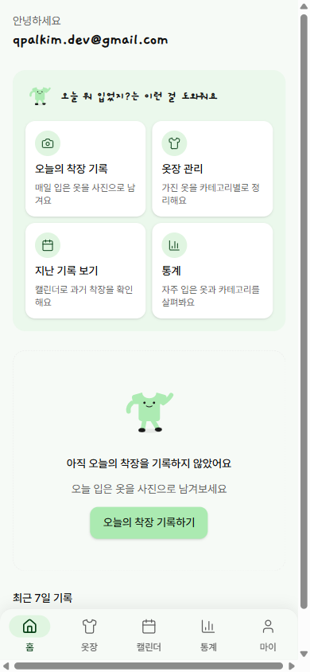
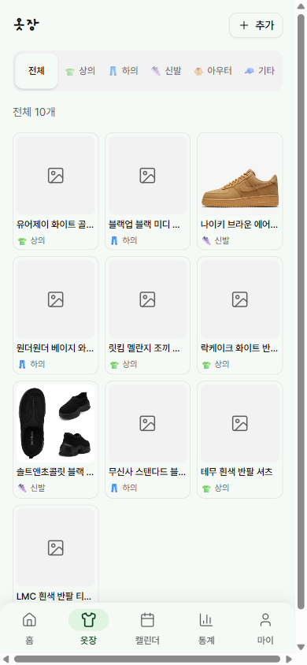
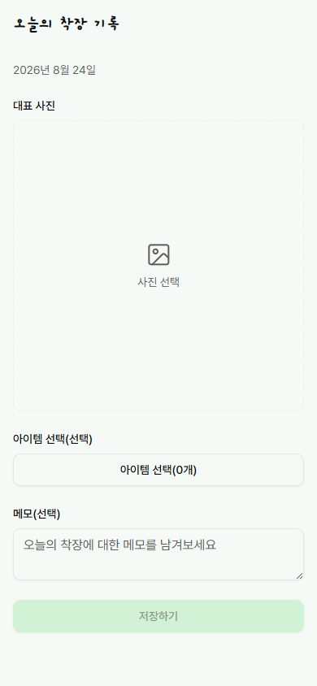
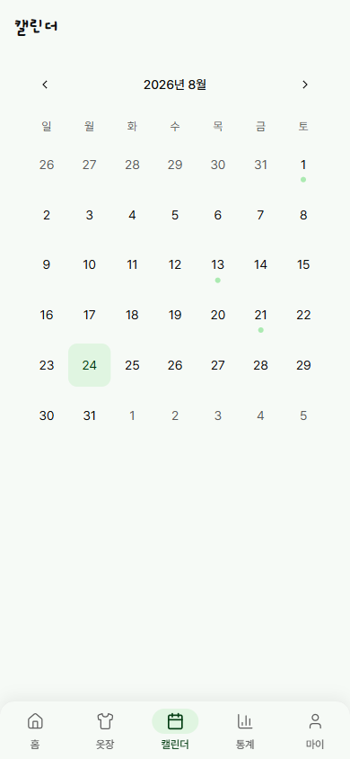
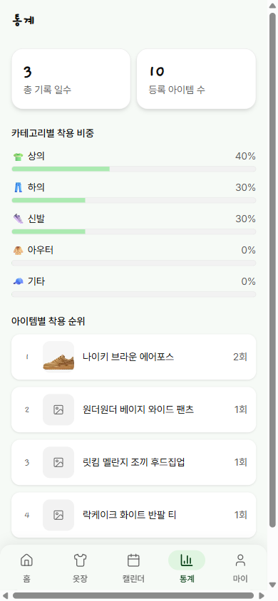
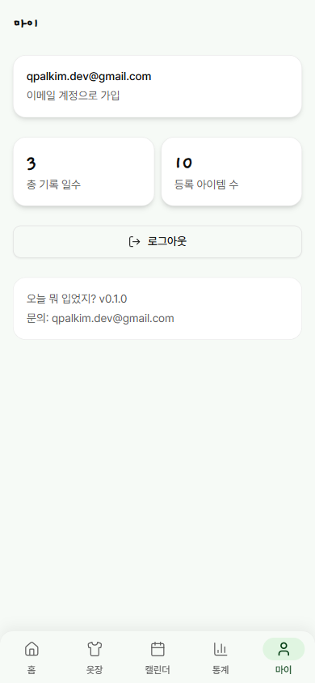

# 👕 오늘 뭐 입었지? (Today's Outfit)


하루 단위로 "오늘 입은 옷"을 기록해, 실제로 어떤 옷을 입고 사는지 데이터로 되돌아보게 하는 모바일 웹 옷장 로그.

- 배포 URL: [todays-outfit-nine.vercel.app](https://todays-outfit-nine.vercel.app/)
- 제품 요구사항: [`docs/PRD.md`](docs/PRD.md)
- 개발 로드맵: [`docs/ROADMAP.md`](docs/ROADMAP.md)
- 백엔드 설계: [`docs/BACKEND.md`](docs/BACKEND.md)

## 💡 왜 만들었나요?

"내가 어떤 옷을 가지고 있는가"는 옷장을 열어보면 알 수 있지만, "나는 실제로 어떤 옷을 입고 살아가고 있는가"는 기억에 의존할 수밖에 없어 정확히 알기 어렵습니다. 옷장 속 옷과 실제 착용 패턴 사이에는 늘 간극이 있습니다.

이 앱이 던지는 질문은 **소유가 아니라 실제 착용 행위**입니다. 매일 입은 옷을 하루 단위로 가볍게 기록해 누적하면, "나는 주로 어떤 옷을 입는가"를 데이터로 되돌아볼 수 있습니다. 그래서 이 프로젝트는 옷장을 정리하는 "옷장 관리 앱"이 아니라, 하루 착장을 쌓아가는 **개인 옷장 로그** 앱으로 만들었습니다.

## 📱 주요 화면

| 홈 | 옷장 | 착장 기록 |
| --- | --- | --- |
|  |  |  |

| 캘린더 | 통계 | 마이 |
| --- | --- | --- |
|  |  |  |

## 🧭 사용자 흐름

```
로그인 → 옷장에 옷 등록 → 오늘의 착장 기록 → 캘린더에서 지난 기록 확인 → 통계로 돌아보기
```

1. **로그인** — 이메일/비밀번호 또는 구글 계정으로 로그인합니다.
2. **옷장에 옷 등록** — 가진 옷을 상의/하의/신발/아우터/기타 카테고리로 나눠 옷장에 등록합니다.
3. **오늘의 착장 기록** — 대표 사진 1장을 올리고, 옷장에서 오늘 입은 아이템을 골라 연결합니다.
4. **캘린더에서 지난 기록 확인** — 날짜별로 기록을 훑어보고, 필요하면 그날의 착장을 수정합니다.
5. **통계로 돌아보기** — 카테고리별 착용 비중과 아이템별 착용 순위로 나만의 옷 입는 패턴을 확인합니다.

## 🛠️ 기술 스택

| 구분 | 기술 |
| --- | --- |
| 프레임워크 | Next.js (App Router), React, TypeScript |
| 스타일링 | TailwindCSS v4, shadcn/ui |
| 폼 · 검증 | React Hook Form, Zod |
| 백엔드 | Supabase (Auth · Database · Storage) |
| 배포 | Vercel |

## 🚀 로컬 실행

1. 의존성 설치

   ```bash
   npm install
   ```

2. 환경변수 설정 — `.env.example`을 `.env.local`로 복사한 뒤 값을 채운다

   ```bash
   cp .env.example .env.local
   ```

   ```env
   NEXT_PUBLIC_SUPABASE_URL=[Supabase 프로젝트 URL]
   NEXT_PUBLIC_SUPABASE_PUBLISHABLE_KEY=[Supabase publishable(anon) 키]
   ```

   두 값 모두 Supabase 대시보드의 Project Settings > API에서 확인할 수 있다. 클라이언트에 노출되는 것을 전제로 한 공개 키이며, 실제 데이터 접근 제어는 Supabase RLS 정책이 담당한다.

3. 개발 서버 실행

   ```bash
   npm run dev
   ```

   [http://localhost:3000](http://localhost:3000)에서 확인할 수 있다.

## ⌨️ 명령어

```bash
npm run dev     # 개발 서버 (Next.js)
npm run build   # 프로덕션 빌드
npm run start   # 프로덕션 서버 실행
npm run lint    # ESLint
```
